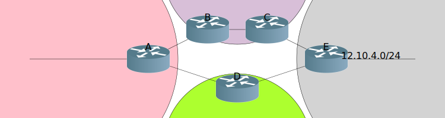
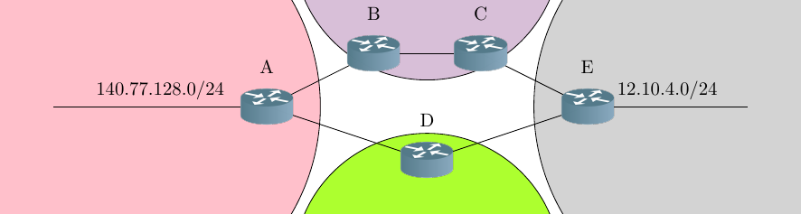
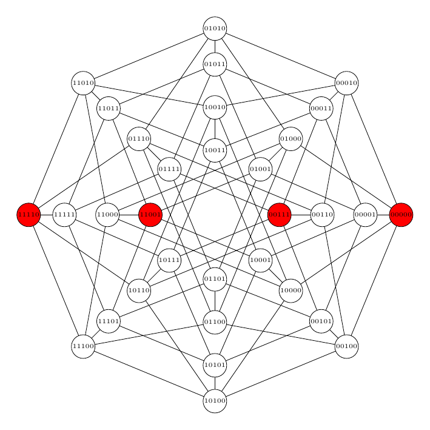
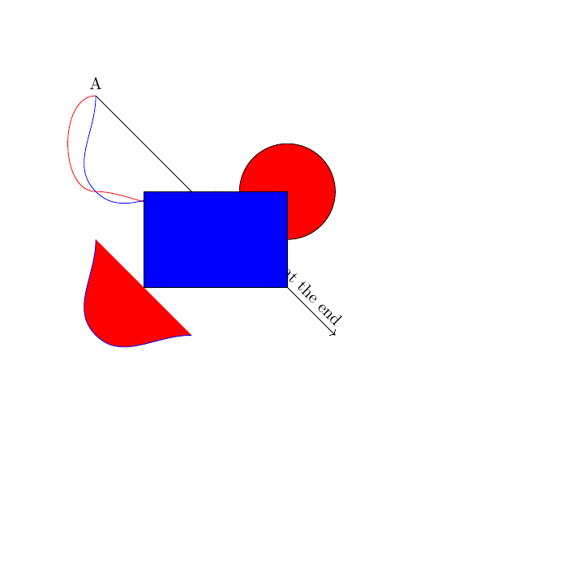

# PYGF

pygf (for Python Graphics Format) is a library inspired by [PGF](https://ctan.org/pkg/pgf).

It provides the user with a common framework that can generate either .svg files or .tex files (to be compiled to a pdf).

## Installation 
No PyPI package is provided yet, so the installation is ``pip install .`` for now.

## Why it exists

The reason to have pictures both in .svg and .pdf is to be used with [quarto](https://quarto.org) for the .html and .pdf outputs respectively.

I could have used .png files, but I like the text to be selectable.
I could have used .tex files and let dvi2svg make the conversion from .tex to .svg but the .svg file is quite big and in particular the text is not selectable.

## Minimal example

See [test.py](tests/test.py) for an example.

## Gallery

This library was used at first for slides on networking, therefore some examples are from networks.

The pdf files were converted into png for inclusion into this gallery, as web browsers are not always capable of rendering pdf.

| SVG file | PDF file  |
|----------|-----------|
|  |  |
|  |  |
|  |  |

## Features

- Lines
- Curves
- Circles
- Rectangles
- Text
- Text on a line
- Arrows

## Not bugs

The output of the svg and pdf file are supposed to be close.
However they are not identical, and they are not supposed to be. Indeed, the .svg file is supposed to be included in a .html file, and the .pdf(.tex) file to be included in a .tex file, to be printed.
In particular, the default font is sans serif for the .svg and serif for the .pdf.

## Bugs

Too many to cite them all.

